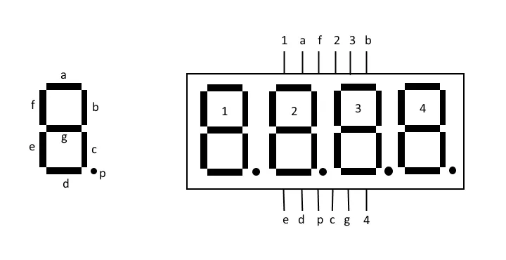

# Micropython Seven segment display
This library implements a class for easier usage of seven segment displays with multiple digits. 

It is only tested on the Raspberry Pi Pico (H) with micropython 1.19.1, but it should work on all newer versions of micropython and other boards, that support micropython and are fast enough, that the display doesn't flicker. 

## Usage
For the simplest example refer to the pinout of your display (found in the datasheet, for example [this one](http://www.xlitx.com/datasheet/5641AS.pdf)). The example table uses the following pin names:



Connect the pins as folowing:

| Raspberry Pi Pico | Display Pin      |
|-------------------|------------------|
| GPIO 16           | 1 (first digit)  |
| GPIO 17           | 2 (second digit) |
| GPIO 18           | 3 (third digit)  |
| GPIO 19           | 4 (fourth digit) |
| GPIO 15           | a (top)          |
| GPIO 14           | b (top right)    |
| GPIO 13           | c (bottom right) |
| GPIO 12           | d (bottom)       |
| GPIO 11           | e (bottom left)  |
| GPIO 10           | f (bottom right) |
| GPIO 9            | g (top left      |
| GPIO 8            | p (point)        |

Use the following code: 
```python
digits = [16, 17, 18, 19]
segments = [15, 14, 13, 12, 11, 10, 9, 8]
display = sevSeg(digits, segments, sevSeg.COMMON_CATHODE)

display.setString("3.141")

while True:
    display.refreshDisplay()
```

## Functions
### Constructor sevSeg(digits, segments, common, led_on_time, digit_delay)
- digits (type list) specify the digit pins (numbers of GPIO Pins)
- segments (type list) specify the segment pins (numbers of GPIO Pins)
- common (either COMMON_CATHODE or COMMON_ANODE), default: COMMON_CATHODE
    - which one to choose is listed in the datasheet of your display
- led_on_time (type int): how long the led should be turned on per cycle \[microseconds\], default 5000us
- digit_delay (type int): how long all leds should be off between the digits \[microseconds\], default 0us

The combination of led_on_time and digit_delay define the refresh rate and brightness of your display. If your display is flickering, try adjusting these values. 

### sevSeg.setDigit(digit, character)
- digit (type int): which digit to set (0 = first digit)
- character (type string): which character to display ([complete list below](#supported-characters))

Sets the character to be displayed on the specified digit.

### sevSeg.setComma(digit)
- digit (type int): which digit to set (0 = first digit)

Sets the comma to be displayed after the specified digit.

### sevSeg.setString(string)
- string (type string): which string to display

The string can only contain the characters listed in the [complete list below](#supported-characters). It can only display as many digits as specified in the constructor and at max one dot/comma after each digit. 

If the string contains two dots/commas, there will be inserted a space between them. If the first character is a dot/comma, the first digit will be empty. 

The function supports both '.' and ',' as dot/comma (also mixed).

### sevSeg.refreshDisplay()
Refreshes the display. This function has to be called in a loop, otherwise the display won't show anything.


## Supported characters
| CHAR | ABCDEFGP | ASCII DEC | ASCII HEX | Note        |
| ---- | -------- | --------- | --------- | ----------- |
| '0'  | 11111100 | 48        | 0x30      |             |
| '1'  | 01100000 | 49        | 0x31      |             |
| '2'  | 11011010 | 50        | 0x32      |             |
| '3'  | 11110010 | 51        | 0x33      |             |
| '4'  | 01100110 | 52        | 0x34      |             |
| '5'  | 10110110 | 53        | 0x35      |             |
| '6'  | 10111110 | 54        | 0x36      |             |
| '7'  | 11100000 | 55        | 0x37      |             |
| '8'  | 11111110 | 56        | 0x38      |             |
| '9'  | 11110110 | 57        | 0x39      |             |
| 'A'  | 11101110 | 65        | 0x41      |             |
| 'b'  | 00111110 | 66        | 0x42      |             |
| 'C'  | 10011100 | 67        | 0x43      |             |
| 'd'  | 01111010 | 68        | 0x44      |             |
| 'E'  | 10011110 | 69        | 0x45      |             |
| 'F'  | 10001110 | 70        | 0x46      |             |
| 'G'  | 10111100 | 71        | 0x47      |             |
| 'H'  | 01101110 | 72        | 0x48      |             |
| 'I'  | 00001100 | 73        | 0x49      |             |
| 'J'  | 01110000 | 74        | 0x4A      |             |
| 'K'  | 01101110 | 75        | 0x4B      | Same as 'H' |
| 'L'  | 00011100 | 76        | 0x4C      |             |
| 'M'  | 00000000 | 77        | 0x4D      | NO DISPLAY  |
| 'n'  | 00101010 | 78        | 0x4E      |             |
| 'O'  | 11111100 | 79        | 0x4F      |             |
| 'P'  | 11001110 | 80        | 0x50      |             |
| 'q'  | 11100110 | 81        | 0x51      |             |
| 'r'  | 00001010 | 82        | 0x52      |             |
| 'S'  | 10110110 | 83        | 0x53      |             |
| 't'  | 00011110 | 84        | 0x54      |             |
| 'U'  | 01111100 | 85        | 0x55      |             |
| 'V'  | 01111100 | 86        | 0x56      | Same as 'U' |
| 'W'  | 00000000 | 87        | 0x57      | NO DISPLAY  |
| 'X'  | 01101110 | 88        | 0x58      | Same as 'H' |
| 'y'  | 01110110 | 89        | 0x59      |             |
| 'Z'  | 11011010 | 90        | 0x5A      | Same as '2' |
| ' '  | 00000000 | 32        | 0x20      | BLANK       |
| '-'  | 00000010 | 45        | 0x2D      | DASH        |
| '.'  | 00000001 | 46        | 0x2E      | DOT/COMMA   |
| '\*' | 11000110 | 42        | 0x2A      | STAR        |
| '_'  | 00010000 | 95        | 0x5F      | UNDERSCORE  |